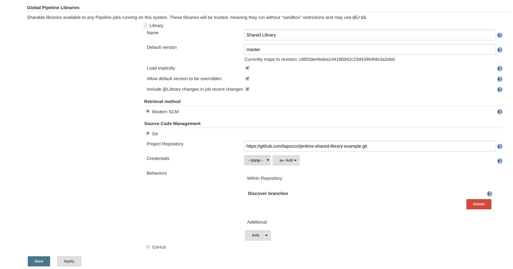
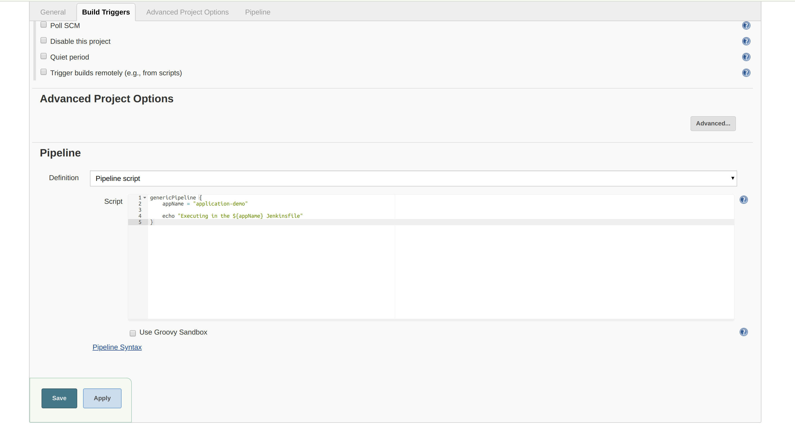
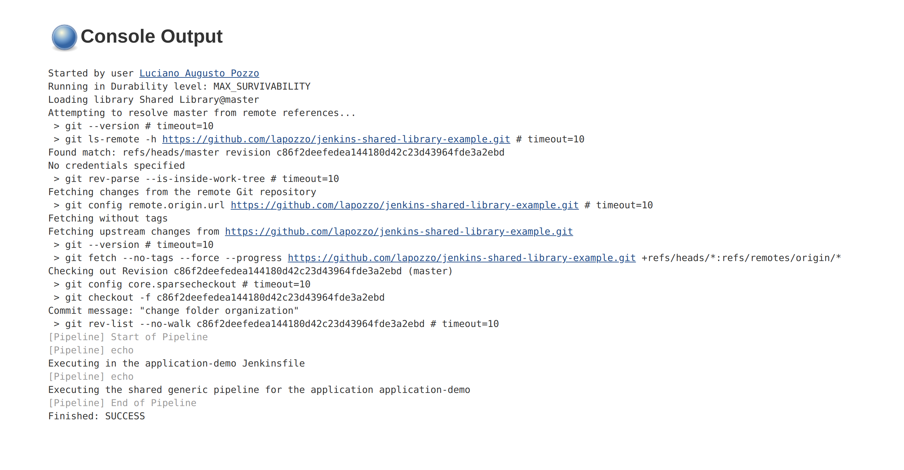

# Jenkins Shared Library Example

The purpose of sharing parts of a pipeline is to avoid redundancies, promoting reuse and facilitate maintenance. In the Jenkins this can be achieved through the [Jenkins Shared Libraries](https://jenkins.io/doc/book/pipeline/shared-libraries/) feature as follow example.

## Start up Jenkins

* docker run -p 8080:8080 -p 50000:50000 jenkins/jenkins:alpine
* Access https://localhost:8080
* Copy and paste the admin password printed in the "docker run" console
* Select the install default plugins option

## Create a Shared Library (respecting the [directory structure](https://jenkins.io/doc/book/pipeline/shared-libraries/#directory-structure))

* Example in the "vars" folder

## Configure the shared library in the Jenkins

* Access option Manage Jenkins/Configure System
* Add a Global Pipeline Libraries
* Expected result:




## Create a Pipeline Job

* Configure the Pipeline Job with the pipeline script below


Pipeline script content:

```json
genericPipeline {
    appName = "application-demo"
	
	echo "Executing in the ${appName} Jenkinsfile"
}
```

* Disable "Use Groovy Sandbox"
* Expected result:




* Execute the job and and verify the log
* Expected result:




Source: https://jenkins.io/doc/book/pipeline/shared-libraries/